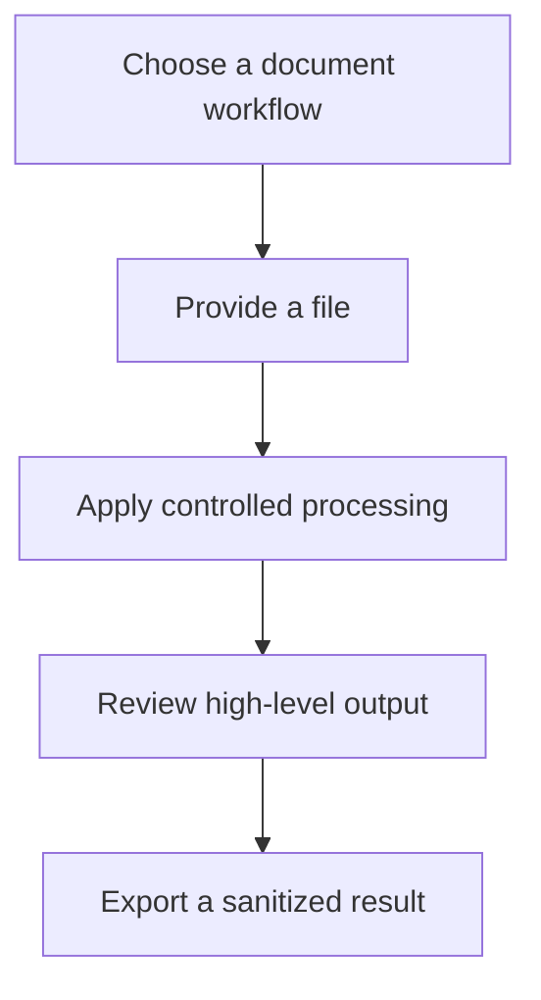

# Workflow

## High-level functional workflow
1. Choose a document workflow
2. Provide a file
3. Apply controlled processing
4. Review high-level output
5. Export a sanitized result

## Publication boundary
- The workflow is intentionally simplified.
- No internal rules, private thresholds, or sensitive processing detail are described here.
